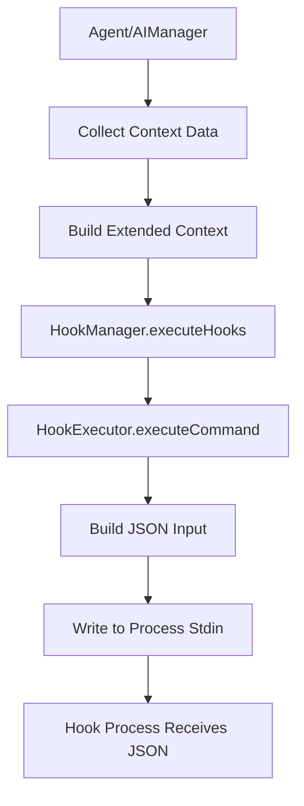

# Data Model: Hook JSON Input Support

**Phase 1** | **Date**: 2024-12-19 | **Feature**: Hook JSON Input Support

## JSON Input Schema

### Base JSON Structure

All hook events receive a consistent base structure via stdin:

```typescript
interface HookJsonInput {
  session_id: string;           // Unique session identifier
  transcript_path: string;      // Absolute path to session file
  cwd: string;                 // Current working directory  
  hook_event_name: HookEvent;  // "PreToolUse" | "PostToolUse" | "UserPromptSubmit" | "Stop"
  
  // Event-specific fields (optional, based on event type)
  tool_name?: string;
  tool_input?: unknown;
  tool_response?: unknown;
  prompt?: string;
}
```

### Event-Specific Schemas

#### PreToolUse Event
```json
{
  "session_id": "wave_session_abc123_xyz789",
  "transcript_path": "/home/user/.wave/sessions/session_xyz789.json",
  "cwd": "/home/user/project",
  "hook_event_name": "PreToolUse",
  "tool_name": "Write",
  "tool_input": {
    "file_path": "/home/user/project/src/index.ts",
    "content": "console.log('Hello World');"
  }
}
```

#### PostToolUse Event
```json
{
  "session_id": "wave_session_abc123_xyz789", 
  "transcript_path": "/home/user/.wave/sessions/session_xyz789.json",
  "cwd": "/home/user/project",
  "hook_event_name": "PostToolUse",
  "tool_name": "Write",
  "tool_input": {
    "file_path": "/home/user/project/src/index.ts",
    "content": "console.log('Hello World');"
  },
  "tool_response": {
    "success": true,
    "message": "File written successfully"
  }
}
```

#### UserPromptSubmit Event
```json
{
  "session_id": "wave_session_abc123_xyz789",
  "transcript_path": "/home/user/.wave/sessions/session_xyz789.json", 
  "cwd": "/home/user/project",
  "hook_event_name": "UserPromptSubmit",
  "prompt": "Please create a new TypeScript file with hello world"
}
```

#### Stop Event
```json
{
  "session_id": "wave_session_abc123_xyz789",
  "transcript_path": "/home/user/.wave/sessions/session_xyz789.json",
  "cwd": "/home/user/project", 
  "hook_event_name": "Stop"
}
```

## Type System Extensions

### Core Type Definitions

```typescript
// hooks/types.ts - New JSON input types
export interface HookJsonInput {
  session_id: string;
  transcript_path: string;
  cwd: string;
  hook_event_name: HookEvent;
  tool_name?: string;
  tool_input?: unknown;
  tool_response?: unknown;
  prompt?: string;
}

// Extended execution context for internal use
export interface ExtendedHookExecutionContext extends HookExecutionContext {
  sessionId?: string;
  toolInput?: unknown;
  toolResponse?: unknown;
  userPrompt?: string;
}

// JSON construction helper
export interface JsonInputBuilder {
  buildJsonInput(context: ExtendedHookExecutionContext): HookJsonInput;
}
```

### Integration Point Types

```typescript
// For aiManager.ts integration
export interface ToolExecutionContext {
  toolName: string;
  toolInput: unknown;
  toolResponse?: unknown; // Only available in PostToolUse
  sessionId: string;
  projectDir: string;
}

// For agent.ts integration  
export interface UserPromptContext {
  prompt: string;
  sessionId: string;
  projectDir: string;
}
```

## Data Flow Architecture

### Context Collection Points



### Session Data Integration

**Session ID Generation**: Use existing session ID from agent instance
**Transcript Path Generation**: Use existing `getSessionFilePath(sessionId)` from `session.ts`
**Working Directory**: Use existing `context.projectDir` from `HookExecutionContext`

### Tool Data Integration

**PreToolUse Data Collection**:
- Tool name: Available in `aiManager` before tool execution
- Tool input: Available as tool arguments before execution
- Collect in `aiManager.ts` around line 482

**PostToolUse Data Collection**:  
- Tool name: Same as PreToolUse
- Tool input: Store from PreToolUse execution
- Tool response: Available after tool execution completes
- Collect in `aiManager.ts` around line 520

**User Prompt Data Collection**:
- Prompt text: Available in `agent.ts` during `handleUserPrompt()`
- Collect in `agent.ts` around line 285

## Error Handling Strategy

### JSON Construction Errors
```typescript
// Graceful fallback for malformed data
function safeJsonConstruction(context: ExtendedHookExecutionContext): HookJsonInput {
  try {
    return buildJsonInput(context);
  } catch (error) {
    // Return minimal valid JSON on construction failure
    return {
      session_id: context.sessionId || 'unknown',
      transcript_path: context.sessionId ? getSessionFilePath(context.sessionId) : '',
      cwd: context.projectDir,
      hook_event_name: context.event
    };
  }
}
```

### Stdin Operation Errors
```typescript
// Handle stdin write failures gracefully
async function writeJsonToStdin(process: ChildProcess, json: HookJsonInput): Promise<void> {
  return new Promise((resolve) => {
    if (!process.stdin) {
      resolve(); // No stdin available, continue
      return;
    }
    
    try {
      process.stdin.write(JSON.stringify(json, null, 2) + '\n');
      process.stdin.end();
      resolve();
    } catch (error) {
      // Log error but don't fail hook execution
      logger?.warn('Failed to write JSON to hook stdin:', error);
      resolve();
    }
  });
}
```

## Backward Compatibility

### Hook Process Compatibility
- Hooks that don't read stdin: Continue to work unchanged
- Hooks that read stdin but don't expect JSON: May receive JSON but can ignore it
- New hooks expecting JSON: Implement JSON parsing from stdin

### Type Compatibility
- Existing `HookExecutionContext` interface: Unchanged, extended separately
- Existing hook configuration: No changes required
- Existing environment variables: Maintained (`WAVE_PROJECT_DIR`)

## Performance Considerations

### JSON Serialization Cost
- Typical JSON payload size: 500-2000 bytes
- Serialization time: <1ms for typical payloads
- Total overhead: <10ms per hook execution

## Validation Strategy

### Integration Testing (TypeScript Example)
```typescript
// packages/agent-sdk/examples/hook-json-input.ts
// Concise working example that can be run with: pnpm tsx examples/hook-json-input.ts

async function testHookJsonProcessing() {
  // Create temporary hook scripts
  // Test JSON input parsing with jq  
  // Validate all event types work correctly
}
```

### Type Safety Through TypeScript
The JSON construction is validated through TypeScript's type system rather than runtime validation:

```typescript
// Type-safe JSON construction ensures validity at compile time
function buildJsonInput(context: ExtendedHookExecutionContext): HookJsonInput {
  return {
    session_id: context.sessionId || 'unknown',
    transcript_path: getSessionFilePath(context.sessionId || ''),
    cwd: context.projectDir,
    hook_event_name: context.event,
    // Optional fields added based on context
    ...(context.toolName && { tool_name: context.toolName }),
    ...(context.toolInput && { tool_input: context.toolInput }),
    ...(context.toolResponse && { tool_response: context.toolResponse }),
    ...(context.userPrompt && { prompt: context.userPrompt }),
  };
}
```

## Next Steps

1. **Phase 2**: Implement `HookExecutor` JSON stdin functionality
2. **Phase 3**: Integrate context collection at trigger points
3. **Phase 4**: Add concise testing with JSON input using jq