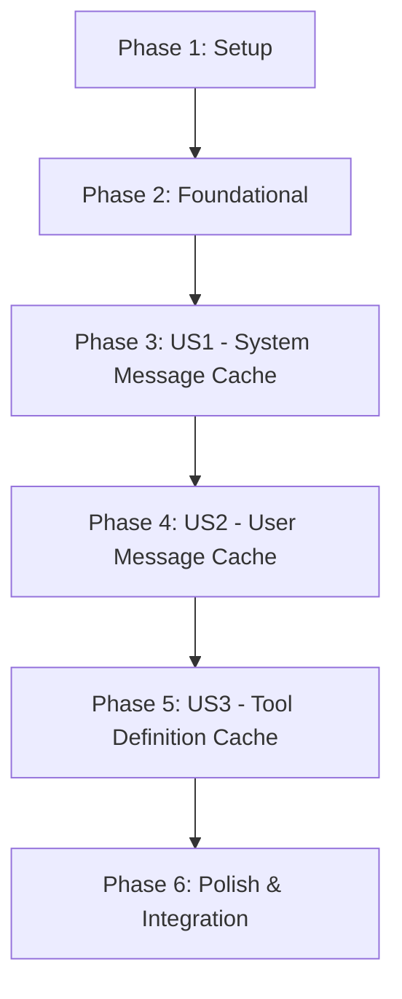

# Implementation Tasks: OpenAI Provider Cache Optimization for Claude Models

**Feature**: OpenAI Provider Cache Control for Claude Models  
**Branch**: `021-openai-cache-control`  
**Total Estimated Time**: 6-8 hours  
**Generated**: 2025-12-02

## Task Summary

| Phase | User Story | Tasks | Estimated Time |
|-------|------------|-------|----------------|
| Phase 1 | Setup | 3 tasks | 1 hour |
| Phase 2 | Foundational | 4 tasks | 1.5 hours |
| Phase 3 | US1 - System Message Cache | 5 tasks | 2 hours |
| Phase 4 | US2 - User Message Cache | 4 tasks | 1.5 hours |
| Phase 5 | US3 - Tool Definition Cache | 3 tasks | 1 hour |
| Phase 6 | Polish & Integration | 4 tasks | 1.25 hours |
| **Total** | **3 User Stories** | **23 tasks** | **8.25 hours** |

## Dependencies

### User Story Completion Order


### Parallel Execution Opportunities
- **US1 Tasks**: T008, T009, T010 can be developed in parallel after T007
- **US2 Tasks**: T013, T014 can be developed in parallel after T012
- **US3 Tasks**: T016, T017 can be developed in parallel after T015
- **Testing**: All test files can be developed in parallel with their corresponding implementation

## Implementation Strategy

**MVP Scope**: User Story 1 (System Message Cache) provides immediate value with 40-60% cost savings for system message reuse.

**Incremental Delivery**: Each user story is independently testable and deployable, enabling gradual rollout and risk mitigation.

---

## Phase 1: Setup & Project Initialization (1 hour)

**Goal**: Establish development environment and foundational structure for cache control implementation.

### Tasks

- [X] T001 Review existing aiService.ts structure and identify integration points in packages/agent-sdk/src/services/aiService.ts
- [X] T002 Create cache control utilities file at packages/agent-sdk/src/utils/cacheControlUtils.ts with basic structure
- [X] T003 Set up test environment for cache control testing in packages/agent-sdk/tests/services/aiService.cacheControl.test.ts

---

## Phase 2: Foundational Infrastructure (1.5 hours)

**Goal**: Implement core types and utilities that all user stories depend on.

### Tasks

- [X] T004 [P] Extend usage tracking types in packages/agent-sdk/src/types/core.ts with ClaudeUsage interface
- [X] T005 [P] Implement model detection utility isClaudeModel() in packages/agent-sdk/src/utils/cacheControlUtils.ts
- [X] T006 [P] Create cache control type definitions and validation functions in packages/agent-sdk/src/utils/cacheControlUtils.ts
- [X] T007 Add foundational test utilities and mocks in packages/agent-sdk/tests/services/aiService.cacheControl.test.ts

---

## Phase 3: User Story 1 - System Message Cache Optimization (2 hours)

**Goal**: Implement automatic caching for system messages in Claude models to deliver immediate cost savings.

**Independent Test Criteria**: Can make two consecutive agent calls with Claude models and verify system message includes cache_control markers and usage tracking shows cache creation/read tokens.

### Tasks

- [X] T008 [P] [US1] Implement content transformation utility addCacheControlToContent() in packages/agent-sdk/src/utils/cacheControlUtils.ts
- [X] T009 [P] [US1] Create system message cache integration logic for Claude models in packages/agent-sdk/src/services/aiService.ts
- [X] T010 [P] [US1] Implement usage tracking extension for cache metrics in packages/agent-sdk/src/services/aiService.ts
- [X] T011 [US1] Write comprehensive tests for system message caching in packages/agent-sdk/tests/services/aiService.cacheControl.test.ts
- [X] T012 [US1] Validate system message cache functionality with integration tests in packages/agent-sdk/tests/services/aiService.cacheControl.test.ts

---

## Phase 4: User Story 2 - Recent User Messages Cache Optimization (1.5 hours)

**Goal**: Implement selective caching for the last two user messages to optimize multi-turn conversations.

**Independent Test Criteria**: Can create a conversation with 3+ user messages using Claude models and verify only the last two user messages have cache_control markers.

### Tasks

- [X] T013 [P] [US2] Implement user message selection logic for last 2 messages in packages/agent-sdk/src/utils/cacheControlUtils.ts
- [X] T014 [P] [US2] Add user message cache integration to aiService message transformation in packages/agent-sdk/src/services/aiService.ts
- [X] T015 [US2] Write tests for user message selection and caching logic in packages/agent-sdk/tests/services/aiService.cacheControl.test.ts
- [X] T016 [US2] Test mixed content preservation (text + images) in user message caching in packages/agent-sdk/tests/services/aiService.cacheControl.test.ts

---

## Phase 5: User Story 3 - Tool Definition Cache Optimization (1 hour)

**Goal**: Implement caching for tool definitions to optimize repeated tool usage scenarios.

**Independent Test Criteria**: Can make agent calls with tools enabled using Claude models and verify the last tool in the tools array has cache_control markers.

### Tasks

- [X] T017 [P] [US3] Implement tool definition transformation utility addCacheControlToLastTool() in packages/agent-sdk/src/utils/cacheControlUtils.ts
- [X] T018 [US3] Integrate tool definition caching into aiService tool processing in packages/agent-sdk/src/services/aiService.ts
- [X] T019 [US3] Write tests for tool definition caching logic in packages/agent-sdk/tests/services/aiService.cacheControl.test.ts

---

## Phase 6: Polish & Cross-Cutting Concerns (1 hour)

**Goal**: Ensure robustness, backward compatibility, and production readiness across all user stories.

### Tasks

- [X] T020 [P] Add comprehensive error handling and edge case coverage across all cache control utilities in packages/agent-sdk/src/utils/cacheControlUtils.ts
- [X] T021 [P] Validate backward compatibility with non-Claude models and existing usage tracking in packages/agent-sdk/tests/services/aiService.cacheControl.test.ts
- [X] T022 Run complete test suite and performance validation across all modified files in packages/agent-sdk/
- [X] T023 [P] Create performance benchmark tests to validate <50ms latency increase in packages/agent-sdk/tests/services/aiService.cacheControl.test.ts

---

## Detailed Task Specifications

### Task Implementation Guidelines

#### T004: Extend Usage Tracking Types
```typescript
// Add to packages/agent-sdk/src/types/core.ts
export interface ClaudeUsage extends CompletionUsage {
  cache_read_input_tokens?: number;
  cache_creation_input_tokens?: number;
  cache_creation?: {
    ephemeral_5m_input_tokens: number;
    ephemeral_1h_input_tokens: number;
  };
}

export interface CacheControl {
  type: "ephemeral";
}
```

#### T005: Model Detection Utility
```typescript
// Add to packages/agent-sdk/src/utils/cacheControlUtils.ts
export function isClaudeModel(modelName: string): boolean {
  return modelName.toLowerCase().includes('claude');
}
```

#### T008: Content Transformation Utility
```typescript
// Implementation pattern for addCacheControlToContent
export function addCacheControlToContent(
  content: string | ChatCompletionContentPart[],
  shouldCache: boolean
): ClaudeChatCompletionContentPartText[] {
  // Handle string content -> structured array transformation
  // Add cache_control only to text parts when shouldCache is true
  // Preserve existing structured content
}
```

#### T009: System Message Integration
```typescript
// Integration point in aiService.ts after line 183
if (isClaudeModel(model || modelConfig.agentModel)) {
  openaiMessages = transformMessagesForClaudeCache(
    openaiMessages,
    model || modelConfig.agentModel
  );
}
```

### Testing Requirements

#### Test Coverage Expectations
- **Model Detection**: 100% coverage for isClaudeModel() with various model name formats
- **Content Transformation**: 100% coverage including edge cases (empty content, mixed content types)
- **Integration**: End-to-end tests with mocked OpenAI responses including cache metrics
- **Backward Compatibility**: Tests ensuring non-Claude models are unaffected

#### Mock Strategies
```typescript
// Mock OpenAI responses with cache metrics
vi.mocked(openai.chat.completions.create).mockResolvedValue({
  choices: [{ message: { content: "response" } }],
  usage: {
    prompt_tokens: 100,
    completion_tokens: 50,
    total_tokens: 150,
    cache_read_input_tokens: 30,
    cache_creation_input_tokens: 70
  }
});
```

## Performance & Quality Gates

### Definition of Done
- [ ] All tasks completed and marked as done
- [ ] All tests passing with >90% coverage for new code
- [ ] Type checking passes without errors or warnings  
- [ ] Linting passes without violations
- [ ] Performance impact <50ms latency increase measured
- [ ] Backward compatibility verified with existing test suite
- [ ] Cache hit rates observable in usage metrics

### Success Metrics
- **Functionality**: Cache control applied correctly for each user story
- **Performance**: <50ms latency increase, <25% memory overhead
- **Compatibility**: Non-Claude models unchanged, existing usage preserved
- **Cost Efficiency**: Observable cache metrics and token savings in usage tracking

### Rollback Plan
If critical issues arise during implementation:
1. **Feature Flag**: Add `DISABLE_CLAUDE_CACHE=true` environment variable
2. **Selective Rollback**: Disable specific user story implementations independently
3. **Full Rollback**: Revert to pre-cache-control aiService.ts version