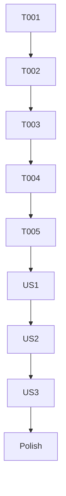

# Tasks: Smart Prefix Match for Trusted Bash Commands

**Feature Branch**: `037-bash-smart-prefix-match`
**Status**: Completed
**Implementation Strategy**: MVP first (User Story 1), followed by UI enhancements (User Story 2) and management (User Story 3).

## Phase 1: Setup

- [x] T001 Initialize feature branch and verify environment
- [x] T002 [P] Create unit test file for smart prefix heuristic in `packages/agent-sdk/tests/utils/bashPrefix.test.ts`

## Phase 2: Foundational

- [x] T003 [P] Implement `getSmartPrefix` utility in `packages/agent-sdk/src/utils/bashParser.ts` based on research heuristic
- [x] T004 [P] Update `PermissionManager` to support prefix matching logic in `packages/agent-sdk/src/managers/permissionManager.ts`
- [x] T005 [P] Update `expandBashRule` in `packages/agent-sdk/src/managers/permissionManager.ts` to use `getSmartPrefix`

## Phase 3: User Story 1 - Trusting a Command with Dynamic Arguments (Priority: P1)

**Goal**: Enable automatic approval of commands matching a trusted prefix.
**Independent Test**: Run `npm install lodash`, select "Yes, and don't ask again", then run `npm install express` and verify it executes without prompt.

- [x] T006 [US1] Update `Agent` class in `packages/agent-sdk/src/agent.ts` to handle prefix-based permission rules
- [x] T007 [US1] Verify `PermissionManager.isAllowedByRule` correctly handles `Bash(pattern*)` patterns
- [x] T008 [US1] Add integration test for prefix matching in `packages/agent-sdk/tests/agent.prefix.test.ts`

## Phase 4: User Story 2 - Reviewing the Smart Prefix (Priority: P2)

**Goal**: Display and allow editing of the suggested prefix in the confirmation UI.
**Independent Test**: Trigger a bash prompt, select "Yes, and don't ask again", and verify the suggested prefix is displayed and editable.

- [x] T009 [US2] Update `ConfirmationProps` in `packages/code/src/components/Confirmation.tsx` to include `suggestedPrefix`
- [x] T010 [US2] Implement prefix calculation in the agent's permission callback in `packages/agent-sdk/src/agent.ts`
- [x] T011 [US2] Update `Confirmation` component UI to display the suggested prefix and allow editing before confirmation in `packages/code/src/components/Confirmation.tsx`

## Phase 5: User Story 3 - Managing Trusted Prefixes (Priority: P3)

**Goal**: Allow users to view and remove trusted prefixes.
**Independent Test**: Manually verify that prefixes saved in `settings.local.json` can be removed and that the system prompts again for those commands.

- [x] T012 [US3] Ensure `settings.local.json` correctly persists and reloads prefix rules
- [x] T013 [US3] (Optional) Add a basic CLI command or documentation on how to manage these rules in `packages/code/src/index.ts`

## Phase 6: Polish & Cross-Cutting Concerns

- [x] T014 [P] Implement hard blacklist for dangerous commands (rm, sudo, etc.) in `getSmartPrefix`
- [x] T015 [P] Run `pnpm build` in `packages/agent-sdk` and verify integration in `packages/code`
- [x] T016 [P] Run `pnpm run type-check` and `pnpm lint` across the monorepo
- [x] T017 Final verification of all user stories and edge cases

## Dependency Graph

