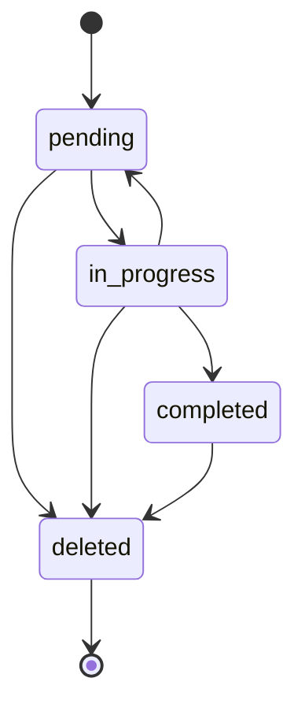

# Data Model: Task Management

## Entities

### Task
Represents a single unit of work within a session.

| Field | Type | Description | Validation |
|-------|------|-------------|------------|
| `id` | `string` | Unique identifier (UUID) | Required, unique |
| `subject` | `string` | Brief, actionable title | Required, non-empty |
| `description` | `string` | Detailed requirements | Required |
| `status` | `enum` | `pending`, `in_progress`, `completed`, `deleted` | Required |
| `activeForm` | `string` | Present continuous form for UI | Optional |
| `owner` | `string` | Assigned agent or user | Optional |
| `blocks` | `string[]` | IDs of tasks blocked by this one | Optional |
| `blockedBy` | `string[]` | IDs of tasks blocking this one | Optional |
| `metadata` | `Record<string, any>` | Arbitrary metadata | Optional |

### Session
A logical grouping of tasks, identified by `sessionId`.

- **Storage Path**: `~/.wave/tasks/{sessionId}/`
- **Relationship**: One Session has many Tasks.

## State Transitions

## Validation Rules
1. **Subject**: Must be in imperative form (e.g., "Fix bug").
2. **ActiveForm**: Should be in present continuous form (e.g., "Fixing bug").
3. **Dependencies**: A task cannot be blocked by itself.
4. **Status**: Only valid transitions are allowed (though the storage layer will be permissive, tools should enforce logic).
