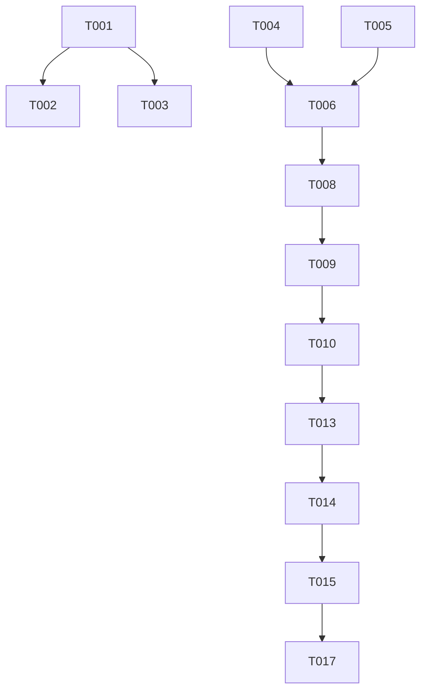

# Tasks: Task List UI

**Feature**: Task List UI
**Branch**: `064-task-list-ui`
**Status**: Completed

## Summary

Implement a persistent, read-only task list summary at the bottom of the message list in the CLI. The UI will update in real-time via an event-driven mechanism in the `agent-sdk`.

## Phase 1: Setup

- [x] T001 Initialize feature documentation structure in `specs/064-task-list-ui/`
- [x] T002 [P] Create placeholder `TaskList.tsx` in `packages/code/src/components/TaskList.tsx`
- [x] T003 [P] Create placeholder `useTasks.ts` in `packages/code/src/hooks/useTasks.ts`

## Phase 2: Foundational (SDK & Event System)

- [x] T004 Update `AgentCallbacks` interface to include `onTasksChange` in `packages/agent-sdk/src/agent.ts` (typescript-expert)
- [x] T005 Modify `TaskManager` to support event emission or callbacks in `packages/agent-sdk/src/services/taskManager.ts` (typescript-expert)
- [x] T006 Integrate `TaskManager` events into the `Agent` class to trigger `onTasksChange` in `packages/agent-sdk/src/agent.ts` (typescript-expert)
- [x] T007 [P] Add unit tests for `TaskManager` event emission in `packages/agent-sdk/tests/services/taskManager.test.ts` (vitest-expert)

## Phase 3: User Story 1 - View Task List in Chat (Priority: P1)

**Goal**: Render a summary of tasks at the bottom of the message list.
**Independent Test**: Create a task via `TaskCreate` tool and verify it appears in the CLI UI.

- [x] T008 Implement `useTasks` hook to subscribe to `onTasksChange` in `packages/code/src/hooks/useTasks.ts` (typescript-expert)
- [x] T009 Implement `TaskList` component using React Ink in `packages/code/src/components/TaskList.tsx` (typescript-expert)
- [x] T010 Integrate `TaskList` into `ChatInterface.tsx` between `MessageList` and `InputBox` in `packages/code/src/components/ChatInterface.tsx` (typescript-expert)
- [x] T011 [P] Add unit tests for `TaskList` component in `packages/code/tests/components/TaskList.test.ts` (vitest-expert)
- [x] T012 [P] Add unit tests for `useTasks` hook in `packages/code/tests/hooks/useTasks.test.ts` (vitest-expert)

## Phase 4: User Story 2 - Task List Visibility & Styling (Priority: P2)

**Goal**: Ensure the task list is persistent, correctly styled, and handles empty states.
**Independent Test**: Verify task list position after long conversations and its behavior when no tasks exist.

- [x] T013 Refine `TaskList` styling to match CLI aesthetic (colors, icons) in `packages/code/src/components/TaskList.tsx` (typescript-expert)
- [x] T014 Implement "No tasks" state handling (hide or show empty message) in `packages/code/src/components/TaskList.tsx` (typescript-expert)
- [x] T015 Implement truncation/wrapping for long task subjects in `packages/code/src/components/TaskList.tsx` (typescript-expert)
- [x] T016 [P] Add integration test for task list rendering in `packages/code/tests/integration/taskList.test.ts` (vitest-expert)

## Phase 5: Polish & Cross-Cutting Concerns

- [x] T017 Run `pnpm build` to ensure package compatibility
- [x] T018 Run `pnpm run type-check` and `pnpm run lint` across the monorepo
- [x] T019 Run `pnpm test:coverage` and ensure no regressions
- [x] T020 Final manual verification of the task list UI in the CLI

## Phase 6: Blocked By Feature

- [x] T021 Update `TaskList` component to display "blocked" status or icon for tasks with `blockedBy` in `packages/code/src/components/TaskList.tsx` (typescript-expert)
- [x] T022 Implement a way to show blocking task subjects in `TaskList` (e.g., on a second line or in parentheses) in `packages/code/src/components/TaskList.tsx` (typescript-expert)
- [x] T023 [P] Add unit tests for "blocked by" UI in `packages/code/tests/components/TaskList.test.ts` (vitest-expert)

## Dependency Graph

## Parallel Execution Examples

- **Setup**: T002, T003 can run in parallel.
- **Foundational**: T007 can run in parallel with T006.
- **US1**: T011, T012 can run in parallel with T010.
- **US2**: T016 can run in parallel with T015.

## Implementation Strategy

1. **MVP First**: Focus on Phase 2 and Phase 3 to get a basic task list rendering in the UI.
2. **Incremental Delivery**: Refine styling and handle edge cases in Phase 4.
3. **Quality Gate**: Ensure all tests pass and coverage is maintained in Phase 5.
