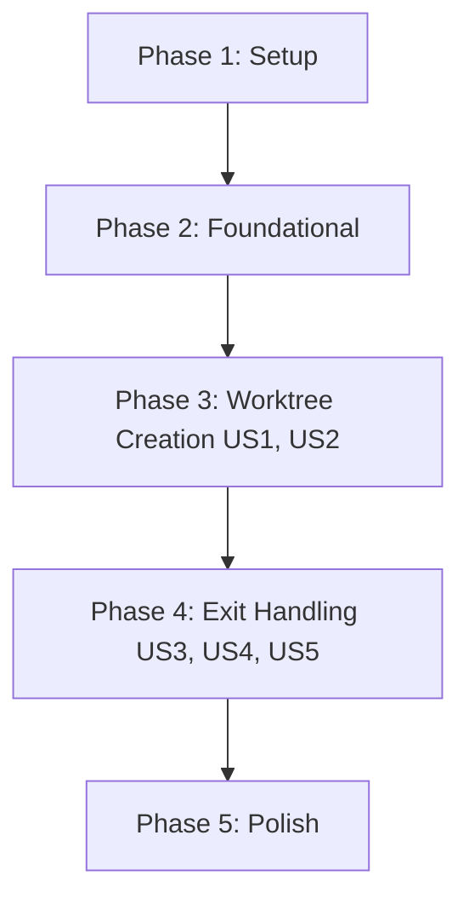

# Tasks: CLI Worktree Support

**Feature**: CLI Worktree Support
**Branch**: `068-cli-worktree-support`
**Implementation Plan**: `specs/068-cli-worktree-support/plan.md`

## Phase 1: Setup

- [x] T001 Create worktree utility file in `packages/code/src/utils/worktree.ts`
- [x] T002 [P] Create git utility file in `packages/agent-sdk/src/utils/git.ts` if needed for shared git logic
- [x] T003 [P] Define `WorktreeSession` type in `packages/code/src/types.ts` or `packages/code/src/utils/worktree.ts`

## Phase 2: Foundational

- [x] T004 Implement git helper functions (get default branch, check status, check commits) in `packages/agent-sdk/src/utils/git.ts`
- [x] T005 Implement worktree management logic (create, remove, list) in `packages/code/src/utils/worktree.ts`
- [x] T006 [P] Add unit tests for git helper functions in `packages/agent-sdk/tests/utils/git.test.ts`
- [x] T007 [P] Add unit tests for worktree management logic in `packages/code/tests/utils/worktree.test.ts`

## Phase 3: User Story 1 & 2 - Worktree Creation (Priority: P1)

**Goal**: Support `-w/--worktree` flag to create and enter a git worktree.

**Independent Test**: Run `wave code -w my-feat` and verify worktree creation and directory change.

- [x] T008 [US1] Update CLI argument parsing in `packages/code/src/index.ts` to support `-w` and `--worktree`
- [x] T009 [US2] Integrate `generateRandomName` in `packages/code/src/index.ts` for auto-generated worktree names
- [x] T010 [US1] Implement worktree initialization flow in `packages/code/src/index.ts` (create worktree, pass `workdir` to CLI)
- [x] T011 [P] Refactor to avoid `process.chdir()` and pass `workdir` explicitly to agent and utilities

## Phase 4: User Story 3, 4 & 5 - Exit Handling (Priority: P1/P2)

**Goal**: Detect changes on exit and show interactive prompt if necessary.

**Independent Test**: Start worktree session, make changes, exit, and verify prompt behavior.

- [x] T012 [US3] Implement `WorktreeExitPrompt` component in `packages/code/src/components/WorktreeExitPrompt.tsx`
- [x] T013 [US3] Update `packages/code/src/App.tsx` to manage exit state and show `WorktreeExitPrompt`
- [x] T014 [US3] Implement logic to detect uncommitted changes and new commits before exit in `packages/code/src/App.tsx`
- [x] T015 [US3] Implement "Keep worktree" and "Remove worktree" actions in `WorktreeExitPrompt.tsx`
- [x] T016 [US5] Ensure immediate exit AND delete worktree and branch if no changes or commits are detected in `packages/code/src/App.tsx`
- [x] T017 [P] [US3] Add tests for `WorktreeExitPrompt` component in `packages/code/tests/components/WorktreeExitPrompt.test.tsx`

## Phase 5: Polish & Cross-cutting Concerns

- [x] T018 Handle edge case: worktree directory already exists in `packages/code/src/utils/worktree.ts`
- [x] T019 Improve error handling for git commands in `packages/code/src/utils/worktree.ts`
- [x] T020 Run full integration tests for the worktree flow
- [x] T021 [P] Run `pnpm run type-check`, `pnpm run lint`, and `pnpm test:coverage`

## Dependency Graph

## Parallel Execution Examples

### User Story 1 & 2 (Phase 3)
- T008 (CLI args) and T009 (Auto-naming) can be done in parallel.

### Exit Handling (Phase 4)
- T012 (UI component) and T014 (Detection logic) can be developed in parallel.
- T017 (UI tests) can be done in parallel with T015 (Action implementation).

## Implementation Strategy

1. **MVP**: Focus on US1 and US2 first to enable worktree creation.
2. **Incremental Delivery**: Add exit detection and prompt (US3, US4, US5) after creation is stable.
3. **Safety First**: Ensure "Remove worktree" is robust to avoid accidental data loss or git state corruption.
